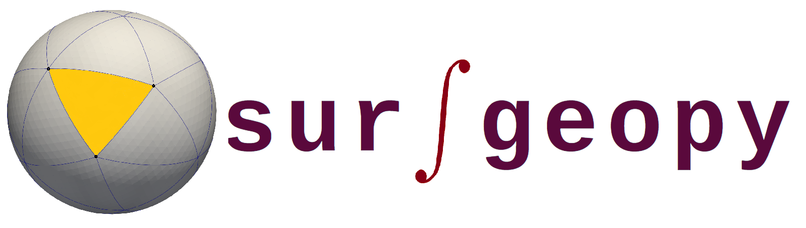
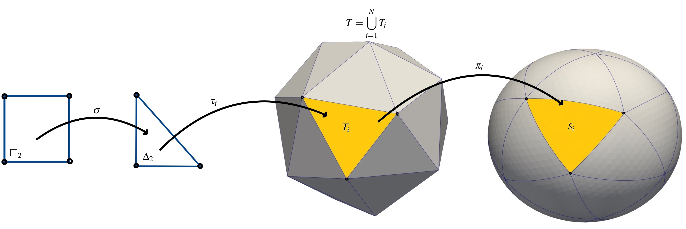
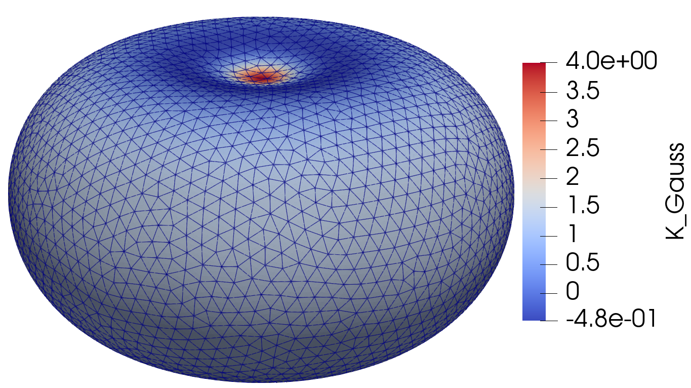
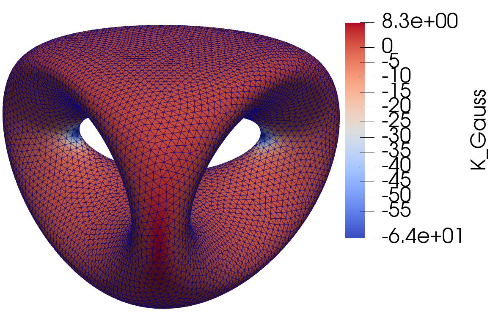
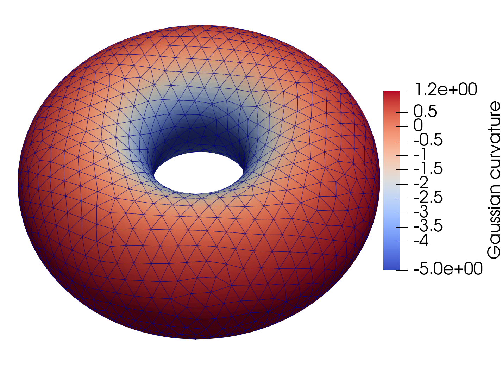
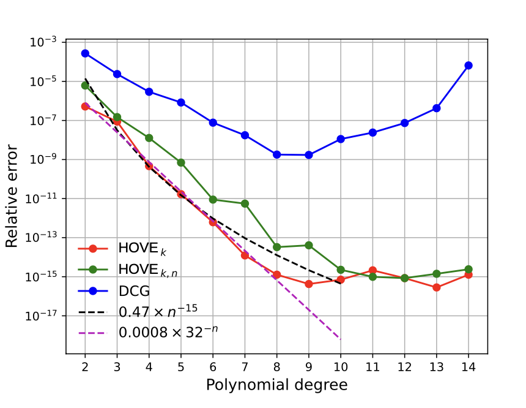
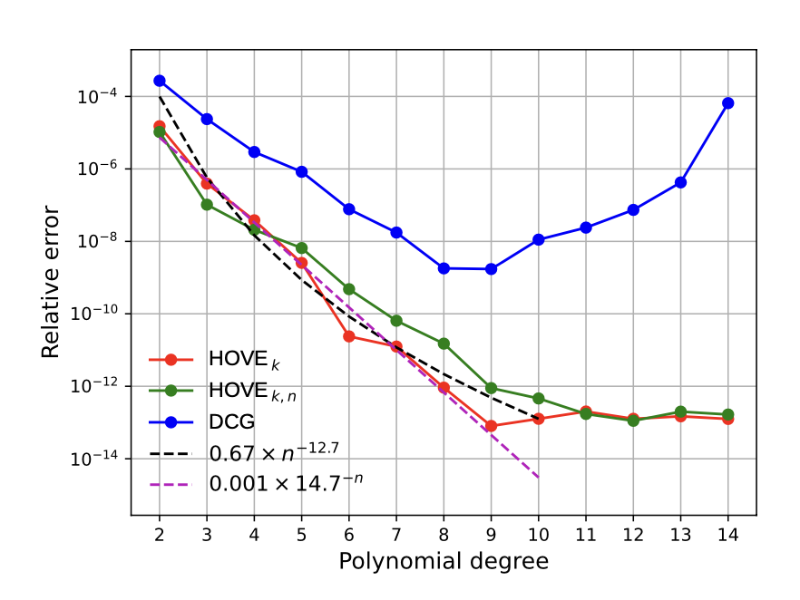
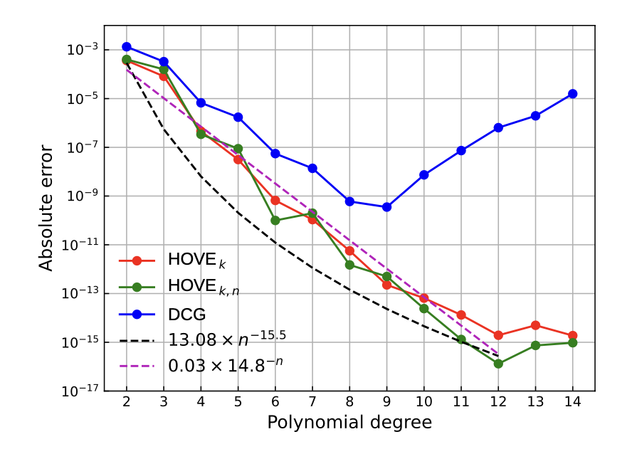

# Surfgeopy
[](https://choosealicense.com/licenses/mit/)
[](https://surfgeopy.readthedocs.io/en/latest/?badge=latest)
[](https://www.python.org/downloads/release/python-380/)


`surfgeopy` is a Python package that is freely available and open-source. Its purpose is to calculate approximations of surface integrals over smooth embedded manifolds.

## 🎉Table of Contents

- [Background](#background)
- [Install](#install)
- [Usage](#usage)
- [Development team](#develpment-team)
- [Contributing](#contributing)
- [License](#license)

## Background

`surfgeopy` rests on curved surface triangulations realised due to $k^{\text{th}}$-order interpolation of the closest point projection, extending initial linear surface approximations. It achieves this by employing a novel technique called square-squeezing, which involves transforming the interpolation tasks of triangulated manifolds to the standard hypercube using a cube-to-simplex transformation that has been recently introduced.
To ensure the stability and accuracy of the computations, surfgeopy leverages classic Chebyshev-Lobatto grids. These grids enable the calculation of high-order interpolants for the surface geometry while avoiding Runge's phenomenon, a common issue in numerical analysis.


## Surface approximation using polynomial interpolation!



Consider an element $T_{i}$ in a reference surface $T$. We consider the affine transformation and closest point projection:

- $\tau_i : \Delta_2 \rightarrow T_i$
- $\pi_i : T_i \rightarrow S_i$

Setting

- $\varphi_i : \square_2 \rightarrow S_i, \quad \varphi_i = \pi_i \circ \tau_i\circ \sigma$
where $\sigma$ is a mapping from the reference square $\square_2$ to the the reference triangle $\Delta_2$.

- We compute  $Q_{G_{2,k}} \varphi_i$ be the vector-valued tensor-polynomial interpolant of $\varphi_i$ in the Chebyshev--Lobbatto grid

- $Q_{G_{2,k}} \varphi_i = \sum_{\alpha \in A_{2,k}} \varphi_i(p_\alpha)L_{\alpha} = \sum_{\alpha \in A_{2,k}}b_\alpha N_{\alpha}$
  where the coefficients $b_\alpha \in \R$ of the Newton interpolation can be computed in closed form.

Substituting the surface geometry $\varphi_i$ with Chebyshev–Lobatto interpolants $Q_{G_{2,k}} \varphi_i$, yields a closed-form expression for the integral. This expression can be accurately computed using high-order quadrature rules.

 $\int_S fdS \approx\sum_{i=1}^K \int_{\square_2} (f\circ\varphi_i)(\mathrm{x}) \sqrt{\det((DQ_{G_{2,k}}\varphi_i(\mathrm{x}))^T DQ_{G_{2,k}}\varphi_i(\mathrm{x}))} d\mathrm{x}\approx \sum_{i=1}^K \sum_{\mathrm{p} \in P}\omega_{\mathrm{p}} (f \circ\varphi_i)(\mathrm{p})\sqrt{\det((DQ_{G_{2,k}}\varphi_i(\mathrm{p}))^T DQ_{G_{2,k}}\varphi_i(\mathrm{p}))}.$


## Square-triangle transformation

- Square-triangle transformations: Deformations of an equidistant grid (left picture) under Duffy's transformation (middle picture) and square-squeezing (right picture)


 <h2 align="center">
💝 Results ! 💝
</h2>                      










## Refinement  

As a refinement procedure, we use the so called triangular quadrisection when the initial triangle is replaced with four triangles until a certain tol is reached. Triangular quadrisection is a linear subdivision procedure which inserts new vertices at the edge midpoints of the input mesh,  thereby producing four new faces for every face of the original mesh:
 
                      x3                        x3
                     /  \      subdivision     /  \
                    /    \        ====>       v3__v2
                   /      \                  / \  / \
                 x1________x2              x1___v1___x2
 
                       Original vertices : x1, x2, x3
 
                       New vertices      : v1, v2, v3
 
                       New faces         : [x1 v1 v3; x2 v2 v1; x3 v3 v2; v1 v2 v3] 
                      


## 🎉 Roadmap

 We are currently working on:

- Incorporating distmesh for generating mesh in python 
- Extending HOSQ  for a wide range of non-parametrized surfaces 

More Coming soon...

### 🛠️ Install

Since this implementation is a prototype, we currently only provide the installation by self-building from source. We recommend to using `git` to get the `surfgeopy` source:

```bash
git clone https://codebase.helmholtz.cloud/interpol/surfgeopy.git
```

> 🚧 Switch to the `conda` or `venv` virtual environment of your choice where you would like to install the library.

From within the environment, install using [pip],

```bash
pip install -e .
```

The `-e` argument specifies to install softlinks so that any changes made by the user to the source in the source folders are reflected in the install when importing modules.

> You **must not** use the command `python setup.py install` to install `surfgeopy`,
as you cannot always assume the files `setup.py` will always be present
in the further development of `surfgeopy`.

- If you would like to use `surfgeopy` in MATLAB, please refer to [this link](https://codebase.helmholtz.cloud/interpol/surfgeopy/-/blob/dev/README_MATLAB.md?ref_type=heads).
- Documentation: https://surfgeopy.readthedocs.io

## Testing

After installation, we encourage you to at least run the unit tests of `surfgeopy`,
where we use [`pytest`](https://docs.pytest.org/en/6.2.x/) to run the tests.

If you want to run all tests, type:

```bash
pytest [-vvv]
```

## Contributing to `surfgeopy`

Contributions to the `surfgeopy` packages are highly welcome.
We recommend you have a look at the [CONTRIBUTING.md](./CONTRIBUTING.md) first.


## Credits and contributors

This work was partly funded by the Center for Advanced Systems Understanding (CASUS)
that is financed by Germany’s Federal Ministry of Education and Research (BMBF)
and by the Saxony Ministry for Science, Culture and Tourism (SMWK)
with tax funds on the basis of the budget approved by the Saxony State Parliament.


## 👷 Development team

### Main code development
- Gentian Zavalani (HZDR/CASUS) <g.zavalani@hzdr.de>

### Mathematical foundation
- Gentian Zavalani (HZDR/CASUS) <g.zavalani@hzdr.de>
- Oliver Sander (TU Dresden) <oliver.sander@tu-dresden.de>
- Michael Hecht (HZDR/CASUS) <m.hecht@hzdr.de>


### Acknowledgement
- Minterpy development team


## Reference
👉 If you use `surfgeopy` in a program or publication, please
acknowledge its authors by adding a reference to the paper
below.

```bibtex
@article{...,
  title={High-order integration on regular triangulated manifolds reaches super-algebraic approximation rates through cubical re-parameterizations},
  author={Zavalani, G., Sander, O. and Hecht, M.},
  journal={arXiv preprint arXiv:2311.13909},
  year={2023}
}
```


## License

[MIT](LICENSE)

