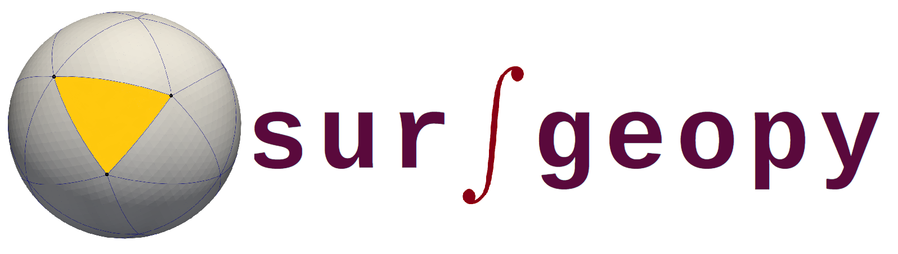
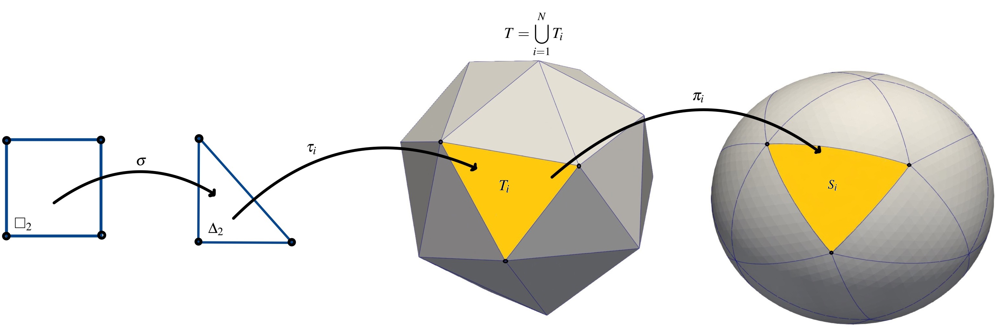
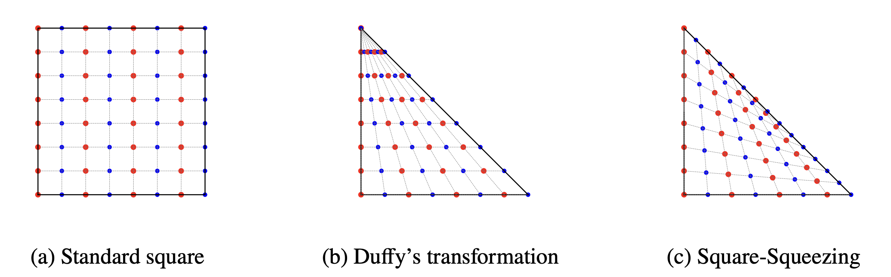
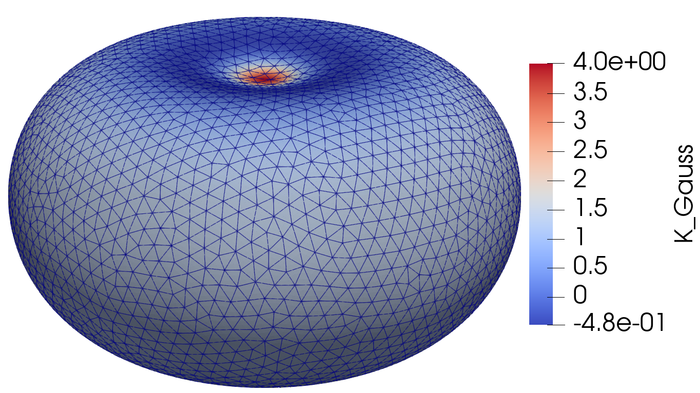
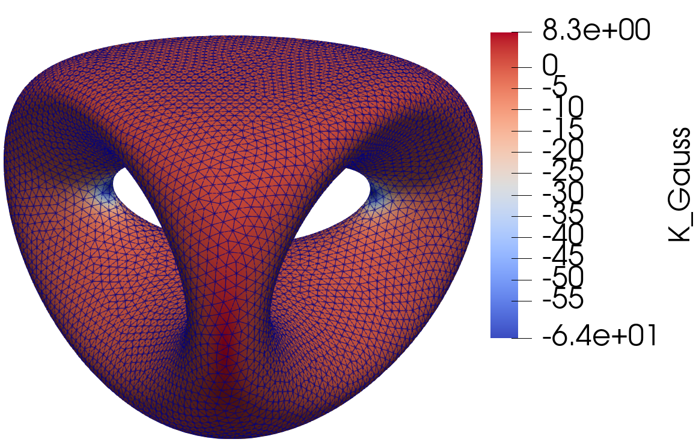
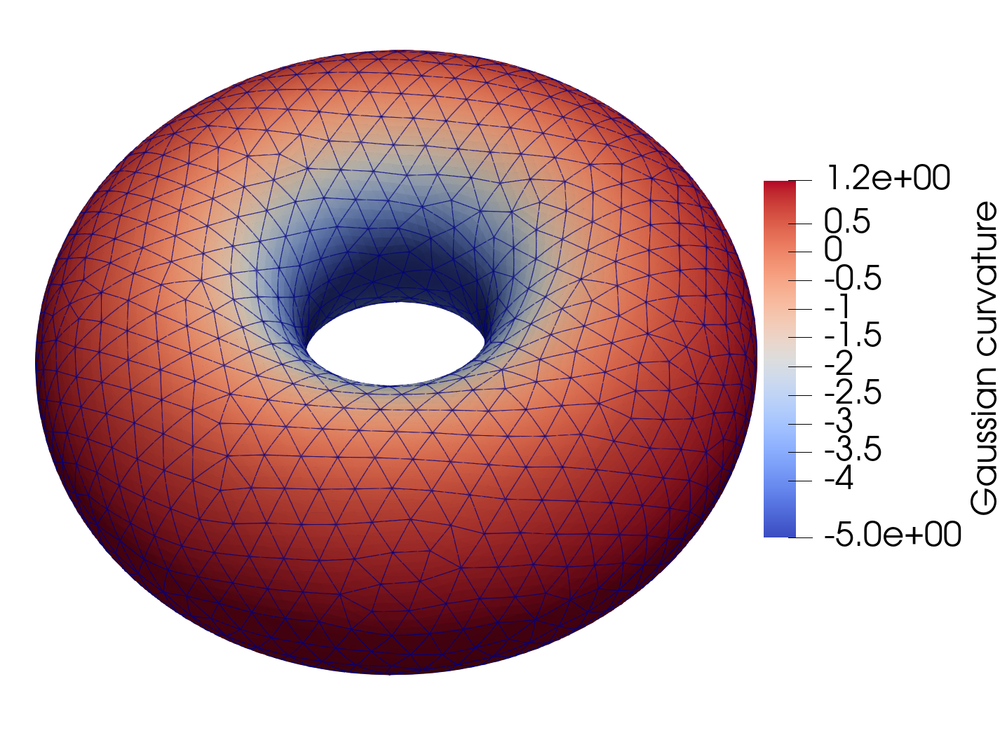
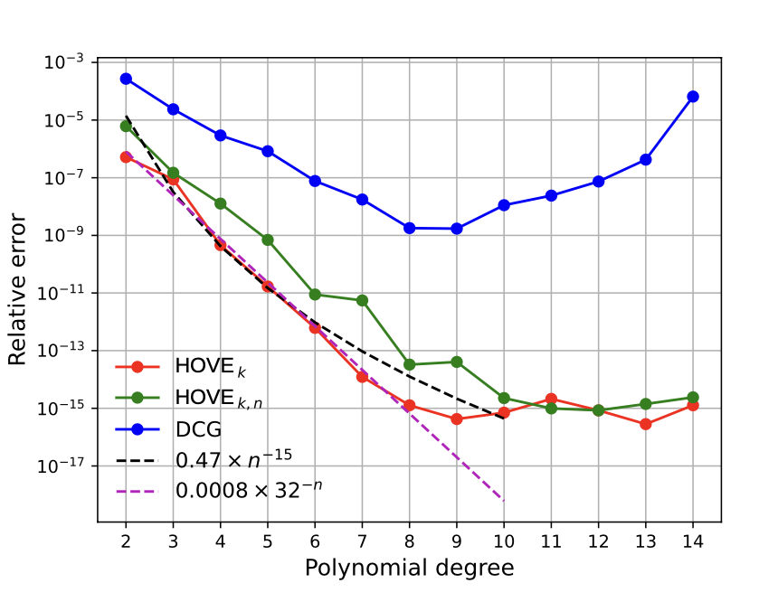
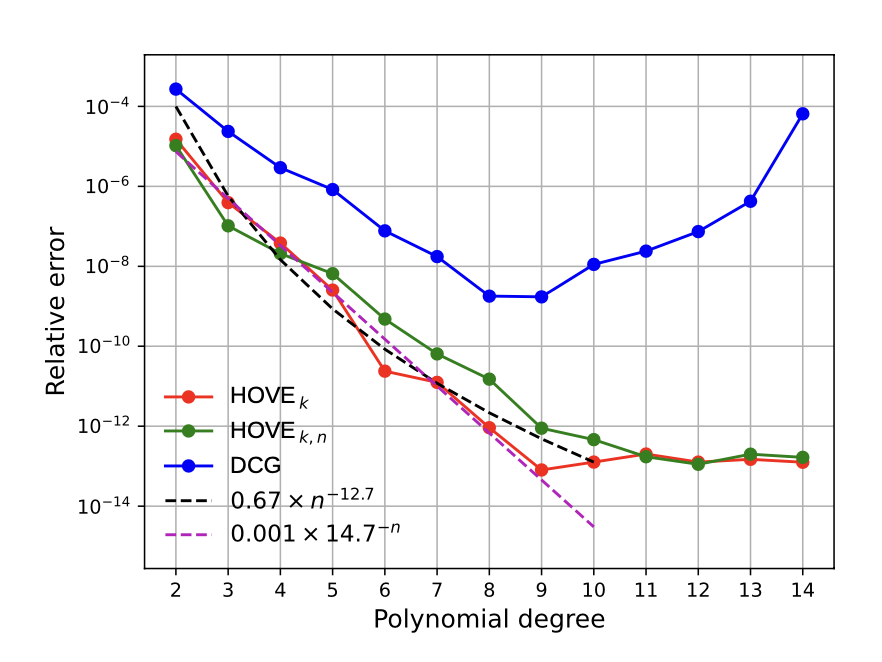
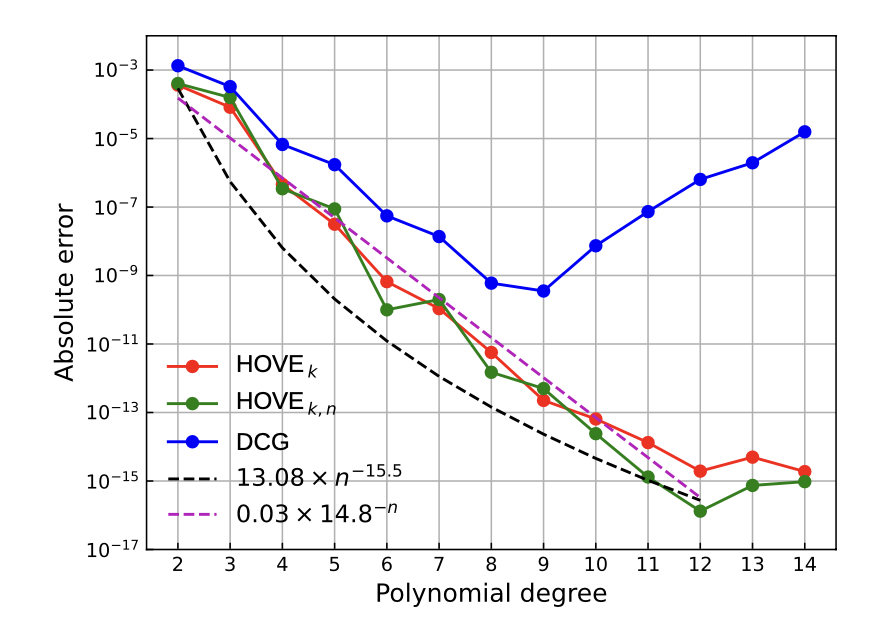

# Surfgeopy
[](https://choosealicense.com/licenses/mit/)
[](https://surfgeopy.readthedocs.io/en/latest/?badge=latest)
[](https://www.python.org/downloads/release/python-3100/)


`surfgeopy` is a freely available, open-source Python package for approximating
surface integrals over smooth embedded manifolds.

`surfgeopy` is designed for high-order integration on smooth embedded surfaces
when an implicit representation is available. Its core idea is to **pull back
the surface interpolation task from each triangle to the reference square**.
There, tensor-product Chebyshev-Lobatto interpolation can be used to build a
stable high-order curved geometry approximation before evaluating surface
integrals with high-order quadrature.

## Why surfgeopy?

- High-order surface integration on implicit/level-set surfaces.
- Square-squeezing pulls interpolation from triangulated manifolds back to the
  square, where tensor-product interpolation is natural.
- Curved geometry approximation from a coarse triangulated reference mesh.
- Explicit configuration of interpolation degree, quadrature degree, refinement,
  and quadrature rule.
- Per-face integration values plus quadrature points and weights for diagnostics.
- Built-in accuracy diagnostics by comparing a base run with an enriched run.
- Adaptive refinement from local diagnostic error indicators.
- Useful for surface PDEs, geometry processing, curvature integrals, and
  validation problems such as sphere/torus area and Gauss-Bonnet checks.

## Table of Contents

- [Background](#background)
- [Why surfgeopy?](#why-surfgeopy)
- [Quickstart](#quickstart)
- [Install](#install)
- [Usage](#usage)
- [Development team](#development-team)
- [Contributing](#contributing)
- [License](#license)

## Background

`surfgeopy` rests on curved surface triangulations realised through
$k^{\text{th}}$-order interpolation of the closest point projection, extending
initial linear surface approximations. The essential step is that the
interpolation task on each curved triangle is **pulled back to the reference
square** by square-squeezing: a cube-to-simplex transformation maps the square
to the reference triangle, so the composed closest-point projection can be
interpolated on a tensor-product domain.

This pullback to the square is what lets `surfgeopy` use classic
Chebyshev-Lobatto grids for the geometry approximation. These grids provide
stable high-order interpolants for the surface geometry and help avoid Runge's
phenomenon, a common issue in polynomial interpolation on poorly chosen nodes.


## Surface Approximation Using Polynomial Interpolation



Consider an element $T_i$ in a reference surface triangulation $T$. The method
combines an affine triangle map with a closest-point projection:

- $\tau_i : \Delta_2 \rightarrow T_i$
- $\pi_i : T_i \rightarrow S_i$

The surface patch is represented by the composed map

- $\varphi_i : \square_2 \rightarrow S_i, \quad \varphi_i = \pi_i \circ \tau_i\circ \sigma$
where $\sigma$ is the square-squeezing map from the reference square
$\square_2$ to the reference triangle $\Delta_2$. This composition pulls the
surface interpolation task from the curved triangle back to the tensor-product
domain $\square_2$.

On this square, `surfgeopy` computes the vector-valued tensor-polynomial
interpolant $Q_{G_{2,k}}\varphi_i$ on a Chebyshev--Lobatto grid.

- $Q_{G_{2,k}} \varphi_i = \sum_{\alpha \in A_{2,k}} \varphi_i(p_\alpha)L_{\alpha} = \sum_{\alpha \in A_{2,k}}b_\alpha N_{\alpha}$
  where the coefficients $b_\alpha \in \mathbf{R}$ of the Newton interpolation
  can be computed in closed form.

Substituting the surface geometry $\varphi_i$ with the Chebyshev--Lobatto
interpolant $Q_{G_{2,k}}\varphi_i$ yields a closed-form expression for the
geometric contribution to the integral. This expression is then evaluated using
high-order quadrature:

 $\int_S f\,dS \approx\sum_{i=1,...,K} \int_{\square_2} (f\circ\varphi_i)(\mathrm{x}) \sqrt{\det((DQ_{G_{2,k}}\varphi_i(\mathrm{x}))^T DQ_{G_{2,k}}\varphi_i(\mathrm{x}))} d\mathrm{x}\approx \sum_{i=1,...,K} \sum_{\mathrm{p} \in P}\omega_{\mathrm{p}} (f \circ\varphi_i)(\mathrm{p})\sqrt{\det((DQ_{G_{2,k}}\varphi_i(\mathrm{p}))^T DQ_{G_{2,k}}\varphi_i(\mathrm{p}))}.$


## Square-Triangle Transformation

Square-triangle transformations are illustrated below by deforming an
equidistant grid. The left picture shows the original grid, the middle picture
shows Duffy's transformation, and the right picture shows square-squeezing.



## Results

<div style="white-space: nowrap;">
    
    
    
</div>


<div style="white-space: nowrap;">
    
    
    
</div>


## Refinement

As a refinement procedure, `surfgeopy` uses triangular quadrisection. Each
triangle is replaced by four subtriangles by inserting new vertices at the edge
midpoints of the input mesh:
 
                      x3                        x3
                     /  \      subdivision     /  \
                    /    \        ====>       v3__v2
                   /      \                  / \  / \
                 x1________x2              x1___v1___x2
 
                       Original vertices : x1, x2, x3
 
                       New vertices      : v1, v2, v3
 
                       New faces         : [x1 v1 v3; x2 v2 v1; x3 v3 v2; v1 v2 v3] 
                      


## Roadmap

We are currently working on:

- Incorporating `distmesh` for mesh generation in Python.
- Extending high-order square quadrature to a wider range of non-parametrized
  surfaces.

More coming soon.

## Install

We recommend using `git` to obtain the `surfgeopy` source:

```bash
git clone https://github.com/zavala92/surfgeopy.git
```

Switch to the `conda` or `venv` virtual environment of your choice before
installing the library.

From within the environment, install using [pip],

```bash
pip install -e .
```

The `-e` argument specifies to install softlinks so that any changes made by the user to the source in the source folders are reflected in the install when importing modules.

> You **must not** use the command `python setup.py install` to install `surfgeopy`,
as you cannot always assume the files `setup.py` will always be present
in the further development of `surfgeopy`.

- If you would like to use `surfgeopy` in MATLAB, please refer to [this link](https://github.com/zavala92/surfgeopy/blob/main/README_MATLAB.md).
- Documentation: https://surfgeopy.readthedocs.io

## Quickstart

```python
import numpy as np

from surfgeopy import IntegrationConfig, LevelSetSurface, SurfaceMesh, integrate


def phi(x: np.ndarray) -> float:
    return x[0] ** 2 + x[1] ** 2 + x[2] ** 2 - 1.0


def grad_phi(x: np.ndarray) -> np.ndarray:
    return np.array([2.0 * x[0], 2.0 * x[1], 2.0 * x[2]])


mesh = SurfaceMesh.from_mat("tests/mesh_test/sphere_N=104.mat")
surface = LevelSetSurface(mesh, phi, grad_phi)
config = IntegrationConfig(
    interpolation_degree=6,
    refinement_level=1,
    integration_degree=14,
    quadrature_rule="Gauss_Legendre",
)

result = integrate(surface, lambda _: 1.0, config)
print(result.total)  # approx. 4*pi
```

The same Minterpy interpolant can also be differentiated to inspect the
high-order surface geometry:

```python
from surfgeopy import surface_geometry

geometry = surface_geometry(surface, config)
print(geometry.gaussian_curvature)
print(geometry.mean_curvature)
```

Available quadrature rules include:

- `"ModePy_VioreanuRokhlin"`: default Vioreanu-Rokhlin simplex rule from
  ModePy, mapped to the reference triangle and pulled back through
  square-squeezing.
- `"Pull_back_Gauss"`: simplex rule pulled back through square-squeezing.
- `"Gauss_Legendre"`: tensor-product Gauss-Legendre rule on the square.
- `"ModePy_XiaoGimbutas"`: Xiao-Gimbutas simplex rule from ModePy, mapped to
  the reference triangle and pulled back through square-squeezing.
- `"ModePy_GrundmannMoeller"`: Grundmann-Moeller simplex rule from ModePy,
  mapped to the reference triangle and pulled back through square-squeezing.

## Testing

After installation, we encourage you to at least run the unit tests of `surfgeopy`,
where we use [`pytest`](https://docs.pytest.org/en/6.2.x/) to run the tests.

If you want to run all tests, type:

```bash
pytest [-vvv]
```

## Modern Python API

The high-level API keeps the mesh, level-set surface, numerical configuration,
and integration result explicit:

```python
from surfgeopy import IntegrationConfig, LevelSetSurface, SurfaceMesh, integrate

mesh = SurfaceMesh.from_mat("tests/mesh_test/sphere_N=104.mat")
surface = LevelSetSurface(mesh, phi, grad_phi)
config = IntegrationConfig(
    interpolation_degree=6,
    refinement_level=1,
    integration_degree=14,
    quadrature_rule="Gauss_Legendre",
)

result = integrate(surface, lambda _: 1.0, config)
print(result.total)
```

For an a posteriori accuracy estimate, compare the selected configuration with
an enriched run:

```python
from surfgeopy import integrate_with_diagnostics

report = integrate_with_diagnostics(surface, lambda _: 1.0, config)
print(report.summary())
```

For the host-mesh adaptation workflow used in degree studies, refine the
reference mesh first using an indicator at face centers and then run the degree
sweep on the adapted surface:

```python
from surfgeopy import refine_by_indicator

adapted = refine_by_indicator(
    surface,
    integrand,
    max_iterations=6,
    threshold_fraction=0.25,
)

adapted_surface = adapted.final_surface
```

The default indicator refinement keeps the adapted reference mesh conforming:
marked triangles are red-refined, and adjacent triangles with split edges are
green-refined before the high-order curved patches are reconstructed.

For differential geometry quantities, use the same configuration with
`surface_geometry`. The routine evaluates the Minterpy surface interpolant built
on the Chebyshev-Lobatto interpolation grid and uses Minterpy's polynomial
differentiation at the quadrature points. It returns tangents, unit normals,
the metric tensor, area density, second fundamental form, mean curvature, and
Gaussian curvature:

```python
from surfgeopy import surface_geometry

geometry = surface_geometry(surface, config)
print(geometry.normal)
print(geometry.metric_tensor)
print(geometry.gaussian_curvature)
```

## Contributing to `surfgeopy`

Contributions to the `surfgeopy` packages are highly welcome.
We recommend you have a look at the [CONTRIBUTING.md](./CONTRIBUTING.md) first.


## Credits and contributors

This work was partly funded by the Center for Advanced Systems Understanding (CASUS)
that is financed by Germany’s Federal Ministry of Education and Research (BMBF)
and by the Saxony Ministry for Science, Culture and Tourism (SMWK)
with tax funds on the basis of the budget approved by the Saxony State Parliament.


## Development Team

### Main Code Development
- Gentian Zavalani (HZDR/CASUS) <gentian.zavalani@tu-dresden.de>

### Mathematical Foundation
- Gentian Zavalani (HZDR/CASUS) <gentian.zavalani@tu-dresden.de>
- Oliver Sander (TU Dresden) <oliver.sander@tu-dresden.de>
- Michael Hecht (HZDR/CASUS) <m.hecht@hzdr.de>


### Acknowledgement
- Minterpy development team


## Reference
👉 If you use `surfgeopy` in a program or publication, please
acknowledge its authors by adding a reference to the paper
below.

```bibtex
@article{zavalani2025high,
  title={High-Order Integration on Regular Triangulated Manifolds Reaches Superalgebraic Approximation Rates Through Cubical Reparametrizations},
  author={Zavalani, Gentian and Sander, Oliver and Hecht, Michael},
  journal={SIAM Journal on Numerical Analysis},
  volume={63},
  number={6},
  pages={2454--2482},
  year={2025},
  publisher={SIAM}
}
```

## License

[MIT](LICENSE)
