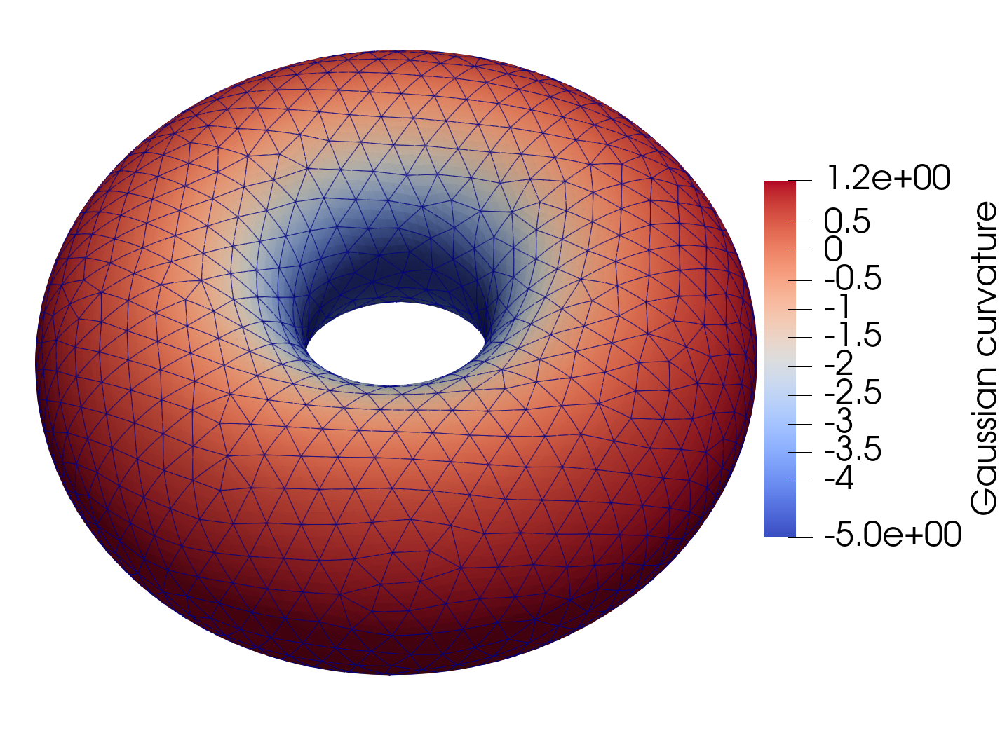
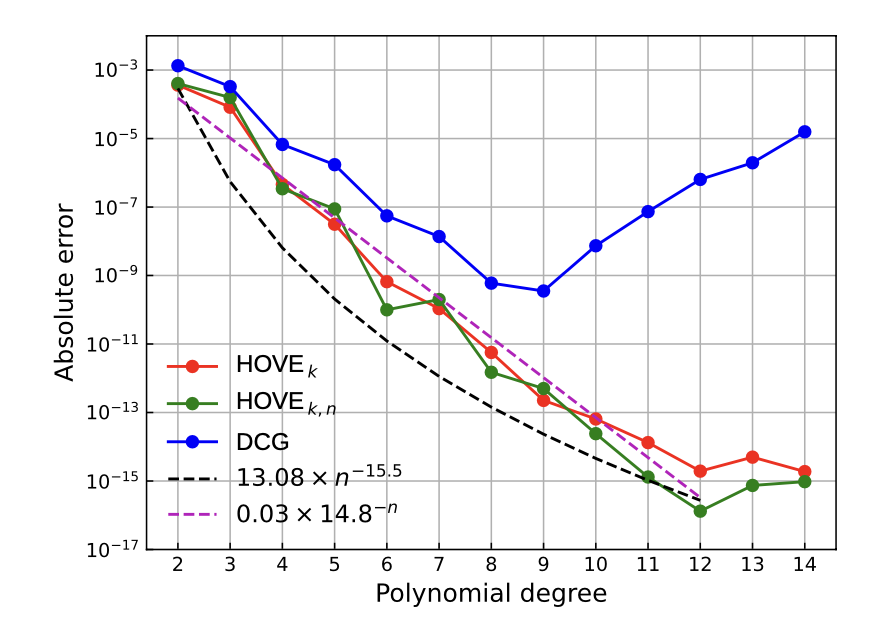
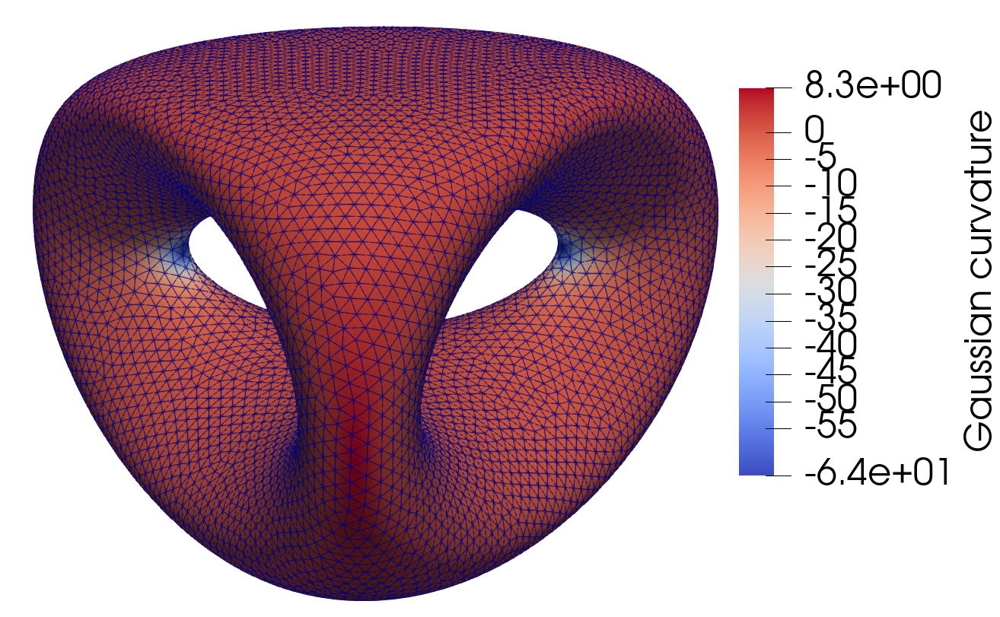
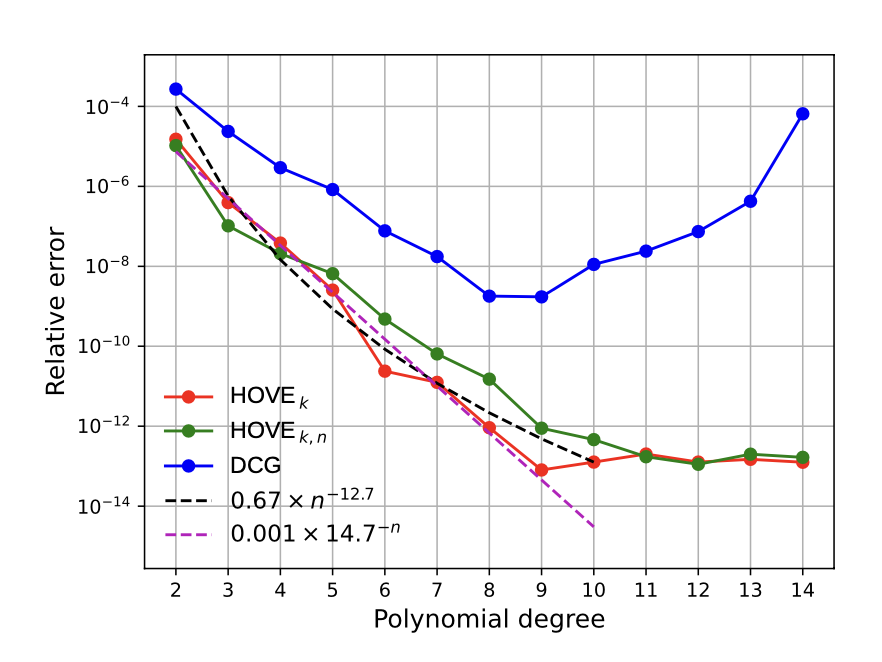
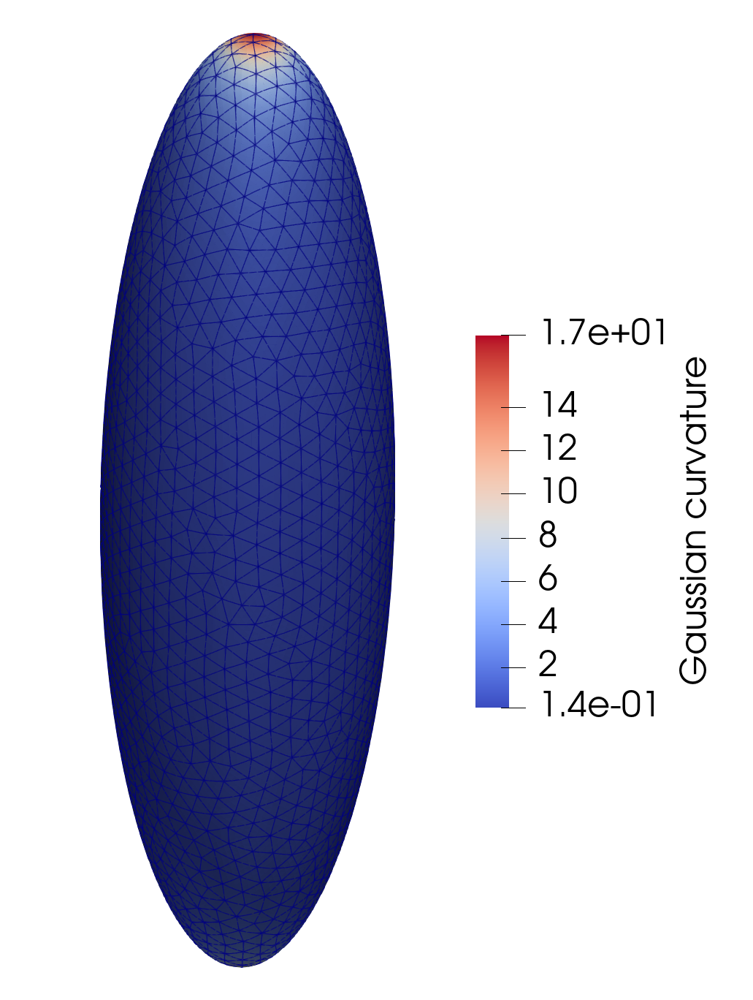
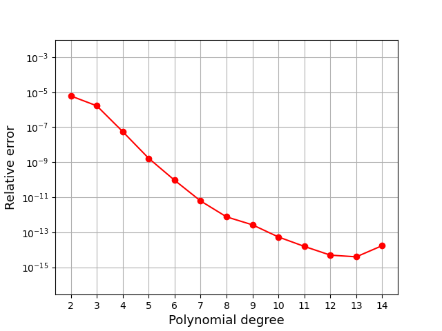
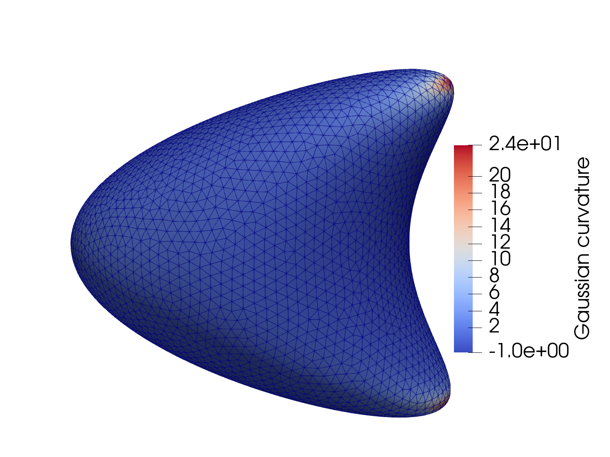
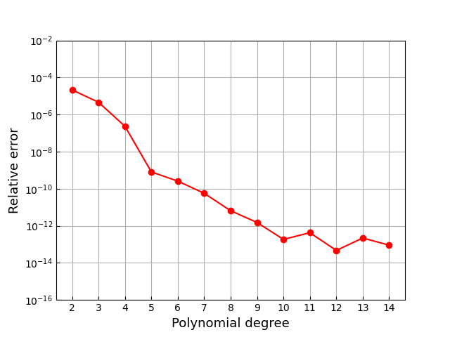
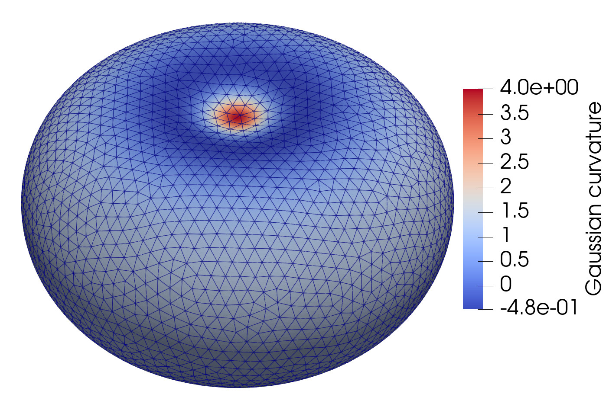
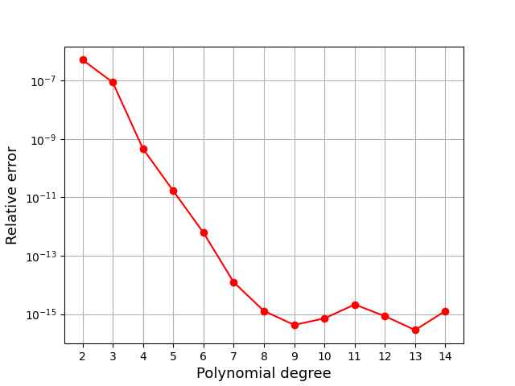

=======================================================
Surface Integrals Benchmark using Gauss-Bonnet Theorem
=======================================================

Overview
--------

This document outlines a comprehensive benchmark for the computation of surface integrals utilizing the high-order volume elements (HOVE) algorithm, specifically tailored for algebraic varieties.

Gauss-Bonnet Theorem on Torus
------------------------------

The Gauss-Bonnet Theorem establishes that the integral of Gaussian curvature over a surface must satisfy the equation:

.. math::

    \int_{\mathcal{M}} KdS = 2\pi \chi(\mathcal{M})

where :math:`\chi(\mathcal{M})` denotes the Euler Characteristic of the surface.

For a torus, with :math:`\chi(\mathcal{M}) = 0`, the theorem simplifies to:

.. math::

    \int_{\mathcal{M}} KdS = 0

Imports
~~~~~~~

.. code-block:: python

   import matplotlib.pyplot as plt
   import numpy as np
   from math import pi
   from time import time
   
   # Local imports
   import surfgeopy as sp

.. code-block:: python

   mesh_path1 = "../meshes/torus_496.mat"
   mesh_path2 = "../meshes/torus_1232.mat"

   R = 2
   r = 1

   def phi(x: np.ndarray):
       ph = np.sqrt(x[0]*x[0] + x[1]*x[1])
       return (ph - R)*(ph - R) + x[2]*x[2] - r*r

   def dphi(x: np.ndarray):
       ph = np.sqrt(x[0]*x[0] + x[1]*x[1])
       return np.array([-2*R*x[0]/ph + 2*x[0], -2*R*x[1]/ph + 2*x[1], 2*x[2]])

   def fun_1(x: np.ndarray):
       t1 = np.sqrt(x[0]*x[0] + x[1]*x[1])
       t2 = (t1 - 2) / 1
       return t2 / (1*t1)

   
Error Evaluation Function
~~~~~~~~~~~~~~~~~~~~~~~~~~~

.. code-block:: python

   def err_g(intp_degree, lp_degree, mesh_path, refinement):
       t0 = time()
       areas = sp.integration(phi, dphi, mesh_path, intp_degree, lp_degree, refinement, fun_1)
       t1 = time()
       sum_area = sum(areas)
       t1 = time()
       exact_area = 0
       print("Absolute error: ", abs(sum_area - exact_area))
       print("The main function takes:", {(t1-t0)})
       error = abs(sum_area - exact_area)
       return error

Degree of Polynomial
~~~~~~~~~~~~~~~~~~~~~~~~~

.. code-block:: python

   Nrange = list(range(2, 18))
   lp_degree = float("inf")
   error1 = [] 
   refinement = 0

   for n in Nrange:
       if n % 1 == 0:
           print(n)
       erro1 = err_g(n, lp_degree, mesh_path2, refinement)
       error1.append(erro1)

Result Visualization
~~~~~~~~~~~~~~~~~~~~~

.. code-block:: python

   plt.semilogy(Nrange, error1, '-or')
   plt.xlabel("Polynomial degree", fontsize=13)
   plt.ylabel("Absolute error", fontsize=13)
   plt.xticks(np.arange(min(Nrange), max(Nrange)+1, 1.0))
   plt.ylim([1.0e-17, 2.0e-03])
   plt.grid()

Gauss Bonnet theorem on a Genus 2 Surface
------------------------------------------

For a genus two surface, the Euler Characteristic is :math:`\chi(\mathcal{M}) = 2 - 2g`, where :math:`(g)` is the genus of the surface. Therefore, we have:

.. math::

    \int_{\mathcal{M}}KdS = -4\pi

Imports
~~~~~~~

.. code-block:: python

    import matplotlib.pyplot as plt
    import numpy as np
    from math import pi
    from time import time

    # Local imports
    import surfgeopy as sp

    mesh_path = "../meshes/genus_two_N=15632.mat"

    def phi(x: np.ndarray):
        return 2*x[1]*(x[1]*x[1] - 3*x[0]*x[0])*(1 - x[2]*x[2]) + (x[0]*x[0] + x[1]*x[1])**2 - (9*x[2]*x[2] - 1)*(1 - x[2]*x[2])

    def dphi(x: np.ndarray):
        return np.array([4*x[0]*(x[0]*x[0] + x[1]*x[1] + 3*x[1]*(x[2]*x[2] - 1)),
                         4*x[1]*(x[0]*x[0] + x[1]*x[1]) + 4*x[1]*x[1]*(1 - x[2]*x[2]) + 2*(3*x[0]*x[0] - x[1]*x[1])*(x[2]*x[2] - 1),
                         4*x[2]*(x[1]*(3*x[0]*x[0] - x[1]*x[1]) + 9*x[2]*x[2] - 5)])
    def fun_1(x: np.ndarray):
        return (4*1**2*(-900*(x[0]**2 + x[1]**2)*x[2]**2 + 45*1**10*(x[0]**2 + x[1]**2)*(-3*x[0]**2*x[1] + x[1]**3)**2*x[2]**6 -                6*1**3*x[1]*(-3*x[0]**2 + x[1]**2)*x[2]**2*(159*(x[0]**2 + x[1]**2) - 460*x[2]**2)+\
                                             15*1*x[1]*(-3*x[0]**2 + x[1]**2)*(9*(x[0]**2 + x[1]**2) - 40*x[2]**2) + 15*1**9*x[1]*(-3*x[0]**2 + x[1]**2)*x[2]**4*(3*x[0]**6 - 9*x[0]**4*x[1]**2 + 21*x[0]**2*x[1]**4 + x[1]**6 + 27*(x[0]**2 + x[1]**2)*x[2]**4) + \
                                             15*1**2*(3*(x[0]**6 + 21*x[0]**4*x[1]**2 - 9*x[0]**2*x[1]**4 + 3*x[1]**6) + 20*(x[0]**2 + x[1]**2)**2*x[2]**2 + 336*(x[0]**2 + x[1]**2)*x[2]**4) + 9*1**5*x[1]*(-3*x[0]**2 + x[1]**2)*(x[0]**6 + 21*x[0]**4*x[1]**2 - 9*x[0]**2*x[1]**4 + 3*x[1]**6 + 212*(x[0]**2 + x[1]**2)*x[2]**4 - 456*x[2]**6) + \
                                             1**4*(-20*x[0]**8 + 163*x[0]**6*x[1]**2 - 39*x[0]**4*x[1]**4 - 215*x[0]**2*x[1]**6 + 7*x[1]**8 - 3*(171*x[0]**6 + 2151*x[0]**4*x[1]**2 - 579*x[0]**2*x[1]**4 + 353*x[1]**6)*x[2]**2 - 1080*(x[0]**2 + x[1]**2)**2*x[2]**4 - 10296*(x[0]**2 + x[1]**2)*x[2]**6) + \
                                             3*1**6*x[2]**2*(3*(x[0]**2 + x[1]**2)*(12*x[0]**6 + 27*x[0]**4*x[1]**2 + 42*x[0]**2*x[1]**4 + 11*x[1]**6) + (345*x[0]**6 + 3213*x[0]**4*x[1]**2 - 417*x[0]**2*x[1]**4 + 587*x[1]**6)*x[2]**2 + 324*(x[0]**2 + x[1]**2)**2*x[2]**4 + 3024*(x[0]**2 + x[1]**2)*x[2]**6) - \
                                             2*1**7*x[1]*(-3*x[0]**2 + x[1]**2)*(2*(x[0]**2 + x[1]**2)**4 + 3*(9*x[0]**6 + 9*x[0]**4*x[1]**2 + 39*x[0]**2*x[1]**4 + 7*x[1]**6)*x[2]**2 + 747*(x[0]**2 + x[1]**2)*x[2]**6 - 972*x[2]**8) + 3*1**8*x[2]**2*(-4*(x[0]**2 + x[1]**2)**2*(3*x[0]**6 - 9*x[0]**4*x[1]**2 + \
                                             21*x[0]**2*x[1]**4 + x[1]**6) - 21*x[1]**2*(-3*x[0]**2 + x[1]**2)**2*(x[0]**2 + x[1]**2)*x[2]**2 - 9*(21*x[0]**6 + 153*x[0]**4*x[1]**2 + 3*x[0]**2*x[1]**4 + 31*x[1]**6)*x[2]**4 - 972*(x[0]**2 + x[1]**2)*x[2]**8)))/(100*x[2]**2 - 12*1**5*x[1]*(-3*x[0]**2 + x[1]**2)*x[2]**2*(x[0]**2 + x[1]**2 + 6*x[2]**2) + \
                                             4*1**3*x[1]*(-3*x[0]**2 + x[1]**2)*(3*(x[0]**2 + x[1]**2) + 10*x[2]**2) + 1**6*x[2]**2*(4*(-3*x[0]**2*x[1] + x[1]**3)**2 + 9*(x[0]**2 + x[1]**2)**2*x[2]**2) + 9*1**2*((x[0]**2 + x[1]**2)**2 - 40*x[2]**4) + 2*1**4*(2*(x[0]**2 + x[1]**2)**3 - 9*(x[0]**2 + x[1]**2)**2*x[2]**2 + 162*x[2]**6))**2
    
Error Evaluation Function
~~~~~~~~~~~~~~~~~~~~~~~~~~~

.. code-block:: python    
    
    def err_g(intp_degree, lp_degree, mesh_path, refinement):
        t0 = time()
        areas = sp.integration(phi, dphi, mesh_path, intp_degree, lp_degree, refinement, fun_1)
        t1 = time()
        sum_area = sum(areas)
        t1 = time()
        exact_area = -4*pi
        print("Relative error: ", abs((sum_area - exact_area) / exact_area))
        print("The main function takes:", {(t1-t0)})
        error = abs((sum_area - exact_area) / exact_area)
        return error

Degree of Polynomial
~~~~~~~~~~~~~~~~~~~~~

.. code-block:: python

    Nrange = list(range(2, 15))
    lp_degree = float("inf")
    error1 = []
    refinement = 0
    for n in Nrange:
        if n % 1 == 0:
            print(n)
        erro1 = err_g(n, lp_degree, mesh_path, refinement)
        error1.append(erro1)

Result Visualization
~~~~~~~~~~~~~~~~~~~~~

.. code-block:: python

    plt.semilogy(Nrange, error1, '-or')
    plt.xlabel("Polynomial degree", fontsize=13)
    plt.ylabel("Relative error", fontsize=13)
    plt.xticks(np.arange(min(Nrange), max(Nrange)+1, 1.0))
    plt.grid()
    

Gauss Bonnet theorem on ellipsoid
------------------------------------

For an oblate spheroid, that is an ellipsoid where :math:`(a = b > c)`, the Euler Characteristic is :math:`\chi(\mathcal{M}) = 2`, therefore we have:

.. math::
       
       \int_{\mathcal{M}}KdS = 4\pi

Imports
~~~~~~~

.. code-block:: python

   import matplotlib.pyplot as plt
   import numpy as np
   from math import pi
   from time import time

   # Local imports
   import surfgeopy as sp

   mesh_path ="../meshes/ellipsoid_N=4024_a=0.6_b=0.8_c=2.mat"
   a=0.6
   b=0.8
   c=2.0

   def phi(x: np.ndarray):
       return (x[0]**2/a**2 + x[1]**2/b**2 + x[2]**2/c**2) - 1

   def dphi(x: np.ndarray):
       return np.array([2*x[0]/a**2, 2*x[1]/b**2, 2*x[2]/c**2])

   def fun_1(x: np.ndarray):
       return 1.0 / (((a*b*c)**2) * (x[0]**2/(a**4) + x[1]**2/(b**4) + x[2]**2/(c**4))**2)
       
Error Evaluation Function
~~~~~~~~~~~~~~~~~~~~~~~~~~~

.. code-block:: python

   def err_g(intp_degree, lp_degree, mesh_path, refinement):
       t0 = time()
       areas = sp.integration(phi, dphi, mesh_path, intp_degree, lp_degree, refinement, fun_1)
       t1 = time()
       sum_area = sum(areas)
       t1 = time()
       exact_area = 4*pi
       print("Relative error: ", abs((sum_area - exact_area)/exact_area))
       print("The main function takes:", {(t1-t0)})
       error = abs((sum_area - exact_area)/exact_area)
       time_s = t1 - t0
       return error, time_s

Degree of Polynomial
~~~~~~~~~~~~~~~~~~~~~

.. code-block:: python

   Nrange = list(range(2, 27))
   lp_degree = float("inf")
   error1 = [] 
   execution_times = []
   refinement = 0
   for n in Nrange:
       if n % 1 == 0:
           print(n)
       erro1, times = err_g(n, lp_degree, mesh_path, refinement)
       error1.append(erro1)
       execution_times.append(times)

Result Visualization
~~~~~~~~~~~~~~~~~~~~~

.. code-block:: python

   plt.semilogy(Nrange, error1, '-or')
   plt.xlabel("Polynomial degree", fontsize=13)
   plt.ylabel("Relative error", fontsize=13)
   plt.xticks(np.arange(min(Nrange), max(Nrange)+1, 1.0))
   plt.grid()

Gauss Bonnet theorem on the first Dziuk’s surface
-------------------------------------------------

Consider the Dzikus surface with implicit equation as: 

.. math::
       \phi(x,y,z) = (x-z^2)^2 +y^2 +z^2-1 = 0

the Euler Characteristic is :math:`\chi(\mathcal{M})=2`, therefore we have:

.. math::

      \int_{\mathcal{M}}KdS = 4\pi

Imports
~~~~~~~~

.. code-block:: python

    import matplotlib.pyplot as plt
    import numpy as np
    from math import pi
    from time import time

    # Local imports
    import surfgeopy as sp

    mesh_path = "../meshes/dziukmesh_N=8088.mat"

    def phi(x: np.ndarray):
        return (x[0] - x[2]**2)**2 + x[1]**2 + x[2]**2 - 1

    def dphi(x: np.ndarray):
        return np.array([2*(x[0] - x[2]**2), 2*x[1], 2*(-2*x[0]*x[2] + 2*x[2]**3 + x[2])])

    def fun_1(x: np.ndarray):
        return (x[1]**2 + x[2]**2 - (x[0] - x[2]**2)*(x[0]*(2*x[0]-1) + 2*x[1]**2 + x[2]**2 - 4*x[0]*x[2]**2 + 2*x[2]**4)) / (x[1]**2 + x[2]**2 + (x[0] - x[2]**2)*(x[0] + (4*x[0]-5)*x[2]**2 - 4*x[2]**4))**2

Error Evaluation Function
~~~~~~~~~~~~~~~~~~~~~~~~~~~

.. code-block:: python

    def err_g(intp_degree, lp_degree, mesh_path, refinement):
        t0 = time()
        areas = sp.integration(phi, dphi, mesh_path, intp_degree, lp_degree, refinement, fun_1)
        t1 = time()
        sum_area = sum(areas)
        t1 = time()
        exact_area = 4*pi
        print("Relative error: ", abs((sum_area - exact_area)/exact_area))
        print("The main function takes:", t1 - t0)
        error = abs((sum_area - exact_area)/exact_area)
        return error

Degree of Polynomial
~~~~~~~~~~~~~~~~~~~~

.. code-block:: python

    Nrange = list(range(2, 15))
    lp_degree = float("inf")
    error1 = [] 
    refinement = 0
    for n in Nrange:
        if n % 1 == 0:
            print(n)
        erro1 = err_g(n, lp_degree, mesh_path, refinement)
        error1.append(erro1)

Result Visualization
~~~~~~~~~~~~~~~~~~~~~

.. code-block:: python

    plt.semilogy(Nrange, error1, '-or')
    plt.xlabel("Polynomial degree", fontsize=13)
    plt.ylabel("Relative error", fontsize=13)
    plt.xticks(np.arange(min(Nrange), max(Nrange)+1, 1.0))
    plt.ylim([1.0e-16, 1.0e-02])
    plt.grid()

Gauss Bonnet theorem on Bioconcave surface
--------------------------------------------

Consider the bioconcave surface with the implicit equation:

.. math::
     
     \phi(x,y,z) = (d^2 + x^2 + y^2 + z^2)^3 - 8d^2(y^2 + z^2) - c^4 = 0

The Euler Characteristic is :math:`\chi(\mathcal{M})=2`, therefore we have:

.. math::
    
    \int_{\mathcal{M}}KdS=4\pi 

.. Imports

.. code-block:: python

    import matplotlib.pyplot as plt
    import numpy as np
    from math import pi
    from time import time

    # Local imports
    import surfgeopy as sp

    mesh_path ="../meshes/bioconcave_N=5980.mat"

    d = 0.80
    c = -0.9344

    def phi(x: np.ndarray):
        return (d**2 + x[0]**2 + x[1]**2 + x[2]**2)**3 - 8*d**2*(x[1]**2 + x[2]**2) - c**4

    def dphi(x: np.ndarray):
        return np.array([6*x[0]*(d**2 + x[0]**2 + x[1]**2 + x[2]**2)**2,
                         6*x[1]*(d**2 + x[0]**2 + x[1]**2 + x[2]**2)**2 - 16*d**2*x[1],
                         6*x[2]*(d**2 + x[0]**2 + x[1]**2 + x[2]**2)**2 - 16*d**2*x[2]])

    def fun_1(x: np.ndarray):
        return (6*(d**2 + x[0]**2 + x[1]**2 + x[2]**2)* \
             ((-16*d**2*x[2] + 6*x[2]*(d**2 + x[0]**2 + x[1]**2 + x[2]**2)**2)* \
                (24*x[0]**2*x[2]*(d**2 + x[0]**2 + x[1]**2 + x[2]**2)**2* \
                   (16*d**2 - 6*(d**2 + x[0]**2 + x[1]**2 + x[2]**2)**2) - \
                  24*x[1]*x[2]*(d**2 + x[0]**2 + x[1]**2 + x[2]**2)**2* \
                   (-16*d**2*x[1] + 6*x[1]*(d**2 + x[0]**2 + x[1]**2 + x[2]**2)**2) + \
                  (-16*d**2*x[2] + 6*x[2]*(d**2 + x[0]**2 + x[1]**2 + x[2]**2)**2)* \
                   (-96*x[0]**2*x[1]**2*(d**2 + x[0]**2 + x[1]**2 + x[2]**2) + \
                     (d**2 + 5*x[0]**2 + x[1]**2 + x[2]**2)* \
                      (-16*d**2 + 24*x[1]**2*(d**2 + x[0]**2 + x[1]**2 + x[2]**2) + \
                        6*(d**2 + x[0]**2 + x[1]**2 + x[2]**2)**2))) + \
               (-16*d**2*x[1] + 6*x[1]*(d**2 + x[0]**2 + x[1]**2 + x[2]**2)**2)* \
                (24*x[0]**2*x[1]*(d**2 + x[0]**2 + x[1]**2 + x[2]**2)**2* \
                   (16*d**2 - 6*(d**2 + x[0]**2 + x[1]**2 + x[2]**2)**2) -  \
                  24*x[1]*x[2]*(d**2 + x[0]**2 + x[1]**2 + x[2]**2)**2* \
                   (-16*d**2*x[2] + 6*x[2]*(d**2 + x[0]**2 + x[1]**2 + x[2]**2)**2) + \
                  (-16*d**2*x[1] + 6*x[1]*(d**2 + x[0]**2 + x[1]**2 + x[2]**2)**2)* \
                   (-96*x[0]**2*x[2]**2*(d**2 + x[0]**2 + x[1]**2 + x[2]**2) + \
                     (d**2 + 5*x[0]**2 + x[1]**2 + x[2]**2)* \
                      (-16*d**2 + 24*x[2]**2*(d**2 + x[0]**2 + x[1]**2 + x[2]**2) +  \
                        6*(d**2 + x[0]**2 + x[1]**2 + x[2]**2)**2))) +  \
               6*x[0]**2*(d**2 + x[0]**2 + x[1]**2 + x[2]**2)**2* \
                (4*x[1]*(16*d**2 - 6*(d**2 + x[0]**2 + x[1]**2 + x[2]**2)**2)* \
                   (-16*d**2*x[1] + 6*x[1]*(d**2 + x[0]**2 + x[1]**2 + x[2]**2)**2) +  \
                  4*x[2]*(16*d**2 - 6*(d**2 + x[0]**2 + x[1]**2 + x[2]**2)**2)* \
                   (-16*d**2*x[2] + 6*x[2]*(d**2 + x[0]**2 + x[1]**2 + x[2]**2)**2) + \
                  (d**2 + x[0]**2 + x[1]**2 + x[2]**2)* \
                   (-576*x[1]**2*x[2]**2*(d**2 + x[0]**2 + x[1]**2 + x[2]**2)**2 + \
                     (-16*d**2 + 24*x[1]**2*(d**2 + x[0]**2 + x[1]**2 + x[2]**2) + \
                        6*(d**2 + x[0]**2 + x[1]**2 + x[2]**2)**2)* \
                      (-16*d**2 + 24*x[2]**2*(d**2 + x[0]**2 + x[1]**2 + x[2]**2) +  \
                        6*(d**2 + x[0]**2 + x[1]**2 + x[2]**2)**2)))))/ \
               (36*x[0]**2*(d**2 + x[0]**2 + x[1]**2 + x[2]**2)**4 +  \
                  (16*d**2*x[1] - 6*x[1]*(d**2 + x[0]**2 + x[1]**2 + x[2]**2)**2)**2 +  \
                  (16*d**2*x[2] - 6*x[2]*(d**2 + x[0]**2 + x[1]**2 + x[2]**2)**2)**2)**2
 
 
Error Evaluation Function
~~~~~~~~~~~~~~~~~~~~~~~~~~~
.. code-block:: python

    def err_g(intp_degree, lp_degree, mesh_path, refinement):
        t0 = time()
        areas = sp.integration(phi, dphi, mesh_path, intp_degree, lp_degree, refinement, fun_1)
        t1 = time()
        sum_area = sum(areas)
        t1 = time()
        exact_area = 4*pi
        print("Relative error: ", abs((sum_area - exact_area)/exact_area))
        print("The main function takes:", {(t1-t0)})
        error = abs((sum_area - exact_area)/exact_area)
        return error
        
        
        
Degree of Polynomial
~~~~~~~~~~~~~~~~~~~~~

.. code-block:: python

    Nrange = list(range(2, 15))
    lp_degree = float("inf")
    error1 = [] 
    refinement = 0
    for n in Nrange:
        if n % 1 == 0:
            print(n)
        erro1 = err_g(n, lp_degree, mesh_path, refinement)
        error1.append(erro1)

Result Visualization
~~~~~~~~~~~~~~~~~~~~~

.. code-block:: python

    plt.semilogy(Nrange, error1, '-or')
    plt.xlabel("Polynomial degree", fontsize=13)
    plt.ylabel("Relative error", fontsize=13)
    plt.xticks(np.arange(min(Nrange), max(Nrange)+1, 1.0))
    plt.grid()
    
    
