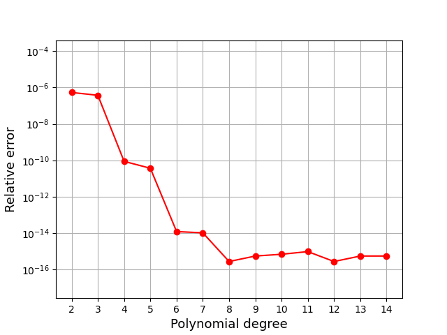

=============================================
Surface Area Computation Benchmark for Sphere
=============================================

Area of the Sphere with Pull-back Gauss Quadrature on Simplex
--------------------------------------------------------------

This benchmark focuses on the computational task of computing surface areas for the standard sphere :math:`S^2`. We utilize the `distmesh` library to generate Delaunay triangulations with :math:`N_{\Delta}=1652` triangles for the sphere. ``surfgeopy`` offers two options for computing surface integrals:

1. Pull-back Gauss Quadrature on Simplex (Default Option) with quadrature degree :math:`14`.

.. code-block:: python

      import surfgeopy as sp
      sp.integration(phi, dphi, mesh_path, intp_degree, lp_degree, refinement, integrand)

If the user would like to keep the default quadrature scheme but change the quadrature degree, use:

.. code-block:: python

      import surfgeopy as sp
      sp.integration(phi, dphi, mesh_path, intp_degree, lp_degree, refinement, integrand, deg_integration)

2. Gauss-Legendre Rule

If the user prefers to keep the default ``Gauss-Legendre`` scheme with a specific quadrature degree, use:

.. code-block:: python

      import surfgeopy as sp
      sp.integration(phi, dphi, mesh_path, intp_degree, lp_degree, refinement, integrand, deg_integration, 'Gauss_Legendre')

Imports
~~~~~~~

.. code-block:: python

   import matplotlib.pyplot as plt
   import numpy as np
   from math import pi
   from time import time

   # Local imports
   import surfgeopy as sp

   mesh_path = "../meshes/SphereMesh_N=1652_r=1.mat"

   def phi(x: np.ndarray):
       return x[0]**2 + x[1]**2 + x[2]**2 - 1

   def dphi(x: np.ndarray):
       return np.array([2*x[0], 2*x[1], 2*x[2]])

Error Evaluation Function
~~~~~~~~~~~~~~~~~~~~~~~~~

.. code-block:: python

   def err_t(intp_degree, lp_degree, mesh_path, refinement):
       f1 = lambda _: 1
       t0 = time()
       areas = sp.integration(phi, dphi, mesh_path, intp_degree, lp_degree, refinement, f1)
       t1 = time()
       sum_area = sum(areas)
       t1 = time()
       exact_area = 4 * pi

       print("Relative error: ", abs(sum_area - exact_area) / exact_area)
       print("The main function takes:", {(t1 - t0)})
       error = abs(sum_area - exact_area) / exact_area
       return error

Polynomial degree
~~~~~~~~~~~~~~~~~~

.. code-block:: python

   Nrange = list(range(2, 15))
   lp_degree = float("inf")
   refinement = 0
   error1 = []
   for n in Nrange:
       if n % 1 == 0:
           print(n)
       erro1 = err_t(int(n), lp_degree, mesh_path, refinement)
       error1.append(erro1)

Result Visualization
~~~~~~~~~~~~~~~~~~~~~

.. code-block:: python

   plt.semilogy(Nrange, error1, '-or')
   plt.xlabel("Polynomial degree", fontsize=13)
   plt.ylabel("Relative error", fontsize=13)
   plt.xticks(np.arange(min(Nrange), max(Nrange) + 1, 1.0))
   plt.ylim([2.758195177427762e-18, 3.9514540203871754e-04])
   plt.grid()
   
   

   
   
   
Spherical Harmonics
--------------------

In this benchmark, we compute a nonconstant integrand. We integrate the :math:`4^{\text{th}}`-order spherical harmonic:

.. math::

   Y^{4}_{5}(x_1, x_2, x_3) = \frac{3\sqrt{385}(x_1^{4} - 6x_2^{2}x_1^{2} + x_2^{4})x_3}{16\sqrt{\pi}}

Visualized below:

.. image:: ../images/Y^4_5_spherical_harmonic.png
   :width: 250px
   :align: center

over the unit sphere :math:`S^2 \subset \mathbb{R}^3` with a mesh resolution :math:`N_{\Delta}=496`. This integral is zero because the spherical harmonics form an :math:`L_2`-orthogonal family of functions, and hence

.. math::

   \int_S Y_5^4\,dS = \langle Y_5^4,1 \rangle_{L_2} = \langle Y_5^4, Y_0^0 \rangle_{L_2} = 0.

Imports
~~~~~~~~

.. code-block:: python

   import matplotlib.pyplot as plt
   import numpy as np
   from math import pi
   from time import time

   # Local imports
   import surfgeopy as sp

   mesh_path ="../meshes/SphereMesh_N=124_r=1.mat"

.. code-block:: python

   def phi(x: np.ndarray):
       return x[0]**2+x[1]**2+x[2]**2-1

   def dphi(x: np.ndarray):
       return np.array([2*x[0],2*x[1],2*x[2]])

   # The integrand
   def fun(x: np.ndarray):
       return (3*np.sqrt(385)*(x[0]**4-6*x[1]**2*x[0]**2+x[1]**4)*x[2])/(16*np.sqrt(np.pi))  # Y_5,4

Error Evaluation Function
~~~~~~~~~~~~~~~~~~~~~~~~~~~

.. code-block:: python

   def err_t(intp_degree, lp_degree, mesh_path, refinement,integ_degree):
       t0 = time()
       areas = sp.integration(phi, dphi, mesh_path, intp_degree, lp_degree, refinement, fun,integ_degree)
       t1 = time()
       sum_area = sum(areas)
       t1 = time()
       exact_int = 0
       print("Absolute error: ", abs(sum_area - exact_int))
       print("The main function takes:", {(t1-t0)})
       error = abs(sum_area - exact_int)
       return error

Polynomial degree
~~~~~~~~~~~~~~~~~~

.. code-block:: python

   Nrange = list(range(2, 18))
   lp_degree = float("inf")
   refinement = 1
   #By default, the integration degree is set to 14.
   integ_degree=25
   error1 = []
   for n in Nrange:
       if n % 1 == 0:
           print(n)
       erro1 = err_t(int(n), lp_degree, mesh_path, refinement,integ_degree)
       error1.append(erro1)

    
Result Visualization
~~~~~~~~~~~~~~~~~~~~~

.. code-block:: python

   plt.semilogy(Nrange, error1, '-or')
   plt.xlabel("Polynomial degree", fontsize=13)
   plt.ylabel("Absolute error", fontsize=13)
   plt.xticks(np.arange(min(Nrange), max(Nrange) + 1, 1.0))
   plt.ylim([1.0e-18, 1.0e-02])
   plt.grid()
   
   
.. image:: ../images/newvs_duffy_sphere_Y_5_4_linf.png
   :width: 450px
   :align: center
   
