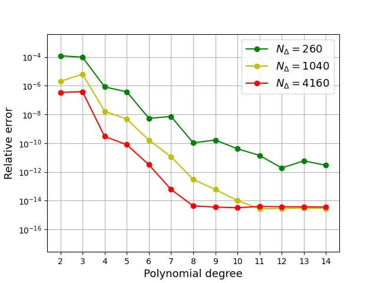

============================================
Surface Area Computation Benchmark for Torus
============================================

This benchmark focuses on the computational task of computing surface areas.

We perform the high-order volume elements (HOVE) algorithm for a torus :math:`T^2_{r,R}` with an inner radius :math:`r=1` and an outer radius :math:`R=2`. We employ the `distmesh` tool to generate Delaunay triangulations, resulting in a mesh with :math:`N_{\Delta}=260` triangles for the torus.

Imports
~~~~~~~

.. code-block:: python

    import matplotlib.pyplot as plt
    import numpy as np
    from math import pi
    from time import time
    import scipy.io
    from numba import njit

Local imports
~~~~~~~~~~~~~

.. code-block:: python

    import surfgeopy as sp

In this experiment, we start with a coarse mesh and iteratively refine it twice for enhanced accuracy.

.. code-block:: python

    mesh_path ="../meshes/torus_260.mat"

    R=2
    r=1

    @njit(fastmath=True)
    def phi(x: np.ndarray):
        ph = np.sqrt(x[0]*x[0] + x[1]*x[1])
        return (ph - R)*(ph - R) + x[2]*x[2] - r*r

    @njit(fastmath=True)
    def dphi(x: np.ndarray):
        ph = np.sqrt(x[0]*x[0] + x[1]*x[1])
        return np.array([-2*R*x[0]/ph + 2*x[0],-2*R*x[1]/ph + 2*x[1],2*x[2]])
        
Error Evaluation Function
~~~~~~~~~~~~~~~~~~~~~~~~~
.. code-block:: python

    def err_t(intp_degree,lp_degree,mesh_path, refinement):
        f1=lambda _: 1
        t0 = time()
        areas = sp.integration(phi,dphi, mesh_path,intp_degree,lp_degree,refinement, f1)
        t1 = time()
        sum_area =sum(areas)
        t1 = time()
        exact_area =(2*pi*R)*(2*pi*r)
        
        print("Relative error: ", abs(sum_area - exact_area) / exact_area)
        print ("The main function takes:",{(t1-t0)})
        error=abs(sum_area - exact_area) / exact_area
        return error
        
Polynomial degree
~~~~~~~~~~~~~~~~~~
.. code-block:: python

    Nrange = list(range(2,15))
    lp_degree=float("inf")
    error1=[] 
    error2=[]
    error3=[]
    for n in Nrange:
        if n%1==0:print(n)
        erro1 = err_t(int(n),lp_degree,mesh_path,0)
        error1.append(erro1)
        erro2 = err_t(n,lp_degree,mesh_path, 1)
        error2.append(erro2)
        erro3 = err_t(n,lp_degree,mesh_path, 2)
        error3.append(erro3)
        
Result Visualization
~~~~~~~~~~~~~~~~~~~~~

.. code-block:: python

    plt.semilogy(Nrange, error1, '-og')
    plt.semilogy(Nrange, error2, '-oy')
    plt.semilogy(Nrange, error3, '-or')
    plt.xlabel("Polynomial degree", fontsize=13)
    plt.ylabel("Relative error", fontsize=13)
    plt.legend(['$N_{\Delta}=260$','$N_{\Delta}=1040$','$N_{\Delta}=4160$'],prop={'size': 13})
    plt.xticks(np.arange(min(Nrange), max(Nrange)+1, 1.0))
    plt.ylim([2.758195177427762e-18,3.9514540203871754e-03])
    plt.grid()
    

