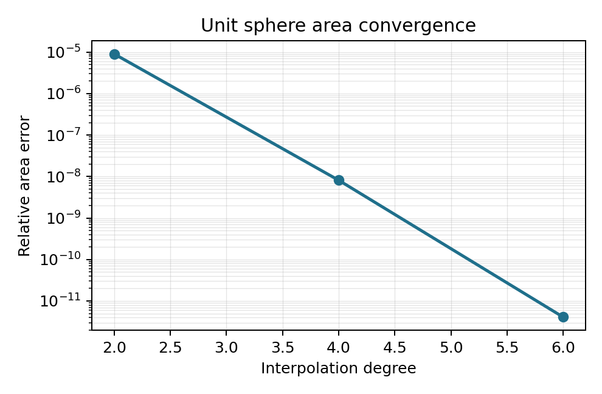

Gallery
=======

Sphere Area Convergence
-----------------------

The sphere example integrates the constant function over the unit sphere and
compares the result with the analytic value :math:`4\pi`.

The corresponding CSV table is written to
``docs/gallery/sphere_area_convergence.csv``.

