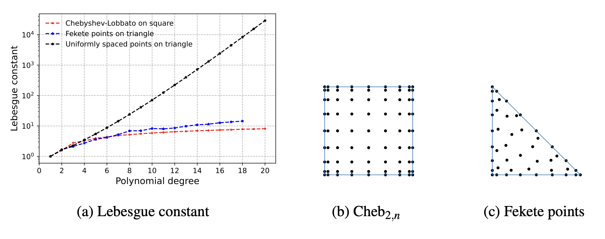
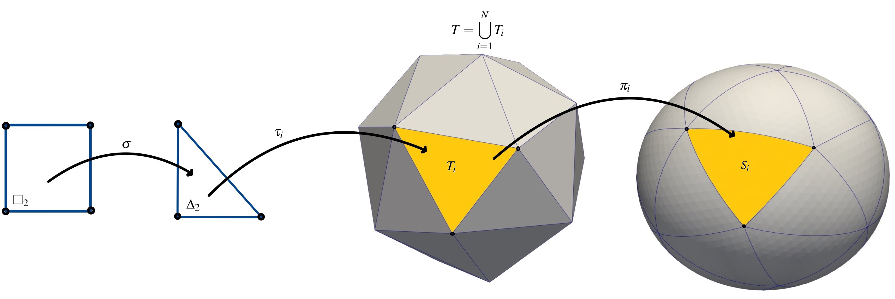
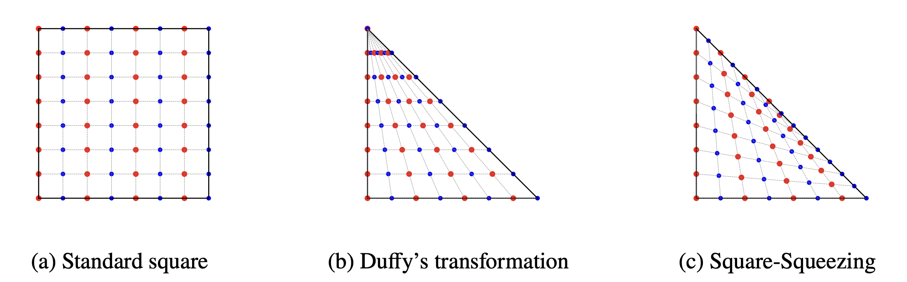

surfgeopy Documentation
=======================

Welcome to the documentation for surfgeopy, a Python package for calculating surface integrals over smooth embedded manifolds.

Introduction
------------

``surfgeopy`` is an open-source Python package designed for approximating surface integrals over smooth embedded manifolds . It employs curved surface triangulations through k-th order interpolation of the closest point projection. This extends initial linear surface approximations.

Square-Squeezing Technique
--------------------------

The key innovation in ``surfgeopy`` lies in the parametrization of triangles :math:`T_i` over squares using a square-squeezing technique. This transformative approach reconfigures interpolation tasks of triangulated manifolds to the standard hypercube through a recently introduced cube-to-simplex transformation. This innovative process enhances the accuracy of surface approximations, making ``surfgeopy`` a powerful tool for high-fidelity calculations.

Chebyshev-Lobatto Grids
-----------------------

To guarantee stability and accuracy in computations, ``surfgeopy`` leverages classic Chebyshev-Lobatto grids. These grids enable the calculation of high-order interpolants for surface geometry while avoiding Runge's phenomenon, a common issue in numerical analysis.

.. admonition:: Figure 1

   Lebesgue constants (a) of uniformly spaced points on the triangle,
   Fekete points, and Chebyshev--Lobatto nodes (b) a visualization of Chebyshev--Lobatto nodes and
   (c) Fekete points for :math:`n=8`.
   
The Lebesgue constant of uniform triangle-grid interpolation tends to rise quickly with increasing polynomial degree. The Lebesgue constant for Chebyshev--Lobatto interpolation increases much slower, while the Lebesgue constant for Fekete points is only marginally worse. 

Fekete points are only known up to degree :math:`18` in the case of total :math:`l_1`-degree interpolation and not for the tensorial :math:`l_\infty`-degree.

Surface Approximation Using Polynomial Interpolation
-----------------------------------------------------

Consider an element :math:`T_i` on a reference surface :math:`T`. The core functionality of our ``surfgeopy`` revolves around:

- Define :math:`\tau_i : \Delta_2 \rightarrow T_i` and :math:`\pi_i : T_i \rightarrow S_i`.
- Set :math:`\varphi_i : \square_2 \rightarrow S_i` as :math:`\varphi_i = \pi_i \circ \tau_i \circ \sigma` where :math:`\sigma` is a mapping from the reference square :math:`\square_2` to the reference triangle :math:`\Delta_2` (Figure 2).

- Compute :math:`Q_{G_{2,k}} \varphi_i` as the vector-valued tensor-polynomial interpolant of :math:`\varphi_i` on the Chebyshev–Lobbatto grid.

- :math:`Q_{G_{2,k}} \varphi_i=\sum_{\alpha \in A_{2,k}} b_\alpha N_{\alpha}` where the coefficients :math:`b_\alpha \in R` of the Newton interpolation can be computed in closed form.

By substituting the surface geometry :math:`\varphi_i` with Chebyshev–Lobatto interpolants :math:`Q_{G_{2,k}} \varphi_i`, a closed-form expression for the integral is obtained. This expression can be accurately computed using high-order quadrature rules.

The integral :math:`\int_S fdS` is approximated as follows:

.. math::
   \sum_{i=1}^K \int_{\square_2} (f \circ \varphi_i)(\mathrm{x}) \sqrt{\det((DQ_{G_{2,k}} \varphi_i(\mathrm{x}))^T DQ_{G_{2,k}} \varphi_i(\mathrm{x}))} d\mathrm{x} 

   \approx \sum_{i=1}^K \sum_{\mathrm{p} \in P} \omega_{\mathrm{p}} (f \circ \varphi_i)(\mathrm{p}) \sqrt{\det((DQ_{G_{2,k}} \varphi_i(\mathrm{p}))^T DQ_{G_{2,k}} \varphi_i(\mathrm{p}))}.
   
 
Then, the approximated integral can now be computed using a quadrature rule. There are two basic options: 
Either use a quadrature rule for the square domain :math:`\square_2` directly (tensorial Gauss--Legendre rules),
or use a simplex rule (symmetric Gauss quadrature rule) and pull it back to :math:`\square_2` by the
inverse of the square-squeezing map :math:`\sigma` effectively integrating over the original triangulation
:math:`T_i` of :math:`T`

Square-Triangle Transformation
===============================

Square-triangle transformations: Deformations of an equidistant grid (left picture) under Duffy's transformation (middle picture) and square-squeezing (right picture)

  
   
.. _figure-2-caption:

.. admonition:: Figure 2

   Bilinear square--simplex transformations: Deformations of equidistant grids,  under Duffy's transformation (b) and square-squeezing  (c).
   
For details on High-order integration on regular triangulated manifolds through cubical re-parameterizations at the heart of
``surfgeopy``, please consult:

   G. Zavalani, O. Sander and M. Hecht: High-order integration on regular triangulated manifolds reaches super-algebraic approximation rates through cubical re-parameterizations `[arXiv] <https://arxiv.org/abs/2311.13909>`_

.. toctree::
   :maxdepth: 2
   :hidden:

   install
   examples
   

   

