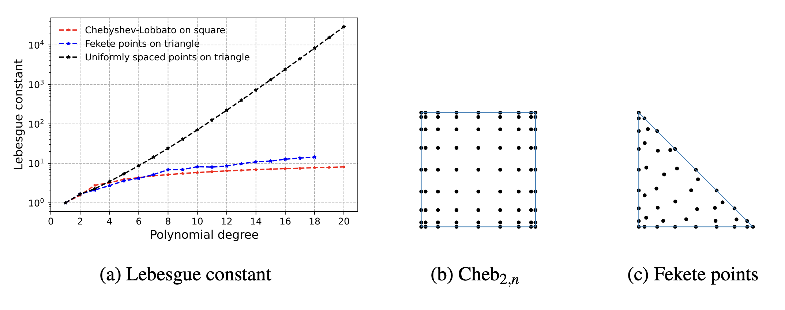

surfgeopy Documentation
=======================

``surfgeopy`` is a Python package for high-order numerical integration on
smooth embedded surfaces with an implicit representation. Starting from a
linear triangulated reference mesh, it constructs high-order curved surface
patches by interpolating the closest-point projection and evaluates surface
integrals with high-order quadrature.

Start Here
----------

New users should begin with :doc:`install`, :doc:`quickstart`, and
:doc:`api_guide`. For numerical options, see :doc:`quadrature` and
:doc:`diagnostics`. For visual examples, see :doc:`gallery` and
:doc:`examples`.

Introduction
------------

``surfgeopy`` is an open-source Python package for approximating surface
integrals over smooth embedded manifolds. The method is based on curved surface
triangulations obtained from :math:`k`-th order interpolation of the
closest-point projection. In this way, an initial piecewise-linear surface
approximation is lifted to a high-order approximation of the target surface.

Square-Squeezing Technique
--------------------------

The central idea in ``surfgeopy`` is to pull the interpolation problem on each
surface triangle back to a square. This is achieved with the square-squeezing
map, a cube-to-simplex transformation that maps the reference square
:math:`\square_2` to the reference triangle :math:`\Delta_2`.

This reparametrization is important because the interpolation task is no longer
performed directly on a triangle. Instead, the composed geometry map is
interpolated on the standard tensor-product domain :math:`\square_2`, where
stable high-order interpolation nodes are readily available.

Chebyshev-Lobatto Grids
-----------------------

To support stable high-order interpolation, ``surfgeopy`` uses classical
Chebyshev--Lobatto grids on the square. These grids allow the package to build
accurate high-order interpolants for the surface geometry while avoiding the
Runge phenomenon associated with poorly chosen interpolation nodes.

.. admonition:: Figure 1

   Lebesgue constants (a) of uniformly spaced points on the triangle,
   Fekete points, and Chebyshev--Lobatto nodes (b) a visualization of Chebyshev--Lobatto nodes and
   (c) Fekete points for :math:`n=8`.
   
The Lebesgue constant of uniform triangle-grid interpolation tends to grow
rapidly with the polynomial degree. By contrast, the Lebesgue constant for
Chebyshev--Lobatto interpolation grows much more slowly, while the Lebesgue
constant for Fekete points is only marginally worse.

Fekete points are only known up to degree :math:`18` for total
:math:`l_1`-degree interpolation, and not for tensorial
:math:`l_\infty`-degree interpolation.

Surface Approximation by Polynomial Interpolation
-------------------------------------------------

.. figure:: images/approximation_frame.jpg
   :alt: Surface Approximation
   :width: 4000

Consider an element :math:`T_i` of the reference triangulation :math:`T`.
``surfgeopy`` constructs a high-order approximation of the corresponding
surface patch by composing the affine triangle map, the square-squeezing map,
and the closest-point projection.

- Define :math:`\tau_i : \Delta_2 \rightarrow T_i` as the affine map from
  the reference triangle to the mesh element, and
  :math:`\pi_i : T_i \rightarrow S_i` as the closest-point projection onto
  the smooth surface patch.
- Set :math:`\varphi_i : \square_2 \rightarrow S_i` by

  .. math::

     \varphi_i = \pi_i \circ \tau_i \circ \sigma,

  where :math:`\sigma : \square_2 \rightarrow \Delta_2` is the
  square-squeezing map shown in Figure 2. This composition is the key pullback:
  the interpolation task for a curved triangle is transferred to the square.
- Compute :math:`Q_{G_{2,k}} \varphi_i`, the vector-valued tensor-polynomial
  interpolant of :math:`\varphi_i` on the Chebyshev--Lobatto grid.
- Write the interpolant as

  .. math::

     Q_{G_{2,k}} \varphi_i
     = \sum_{\alpha \in A_{2,k}} b_\alpha N_{\alpha},

  where the coefficients :math:`b_\alpha \in \mathbb{R}` of the Newton
  interpolation can be computed in closed form.

Substituting the exact surface geometry :math:`\varphi_i` with its
Chebyshev--Lobatto interpolant :math:`Q_{G_{2,k}} \varphi_i` yields a
closed-form approximation of the geometric contribution to the integral. This
expression is then evaluated accurately with high-order quadrature rules.

The integral :math:`\int_S f\,dS` is approximated as follows:

.. math::
   \sum_{i=1}^K \int_{\square_2} (f \circ \varphi_i)(\mathrm{x}) \sqrt{\det((DQ_{G_{2,k}} \varphi_i(\mathrm{x}))^T DQ_{G_{2,k}} \varphi_i(\mathrm{x}))} d\mathrm{x} 

   \approx \sum_{i=1}^K \sum_{\mathrm{p} \in P} \omega_{\mathrm{p}} (f \circ \varphi_i)(\mathrm{p}) \sqrt{\det((DQ_{G_{2,k}} \varphi_i(\mathrm{p}))^T DQ_{G_{2,k}} \varphi_i(\mathrm{p}))}.
   
 
The resulting integral can be evaluated in two equivalent ways. One may use a
quadrature rule directly on the square :math:`\square_2`, such as a tensorial
Gauss--Legendre rule. Alternatively, one may use a simplex quadrature rule, for
example a symmetric Gauss rule on :math:`\Delta_2`, and pull it back to
:math:`\square_2` through the inverse of the square-squeezing map
:math:`\sigma`. This second option keeps the quadrature naturally tied to the
original triangulation :math:`T_i` of :math:`T`.

Square--Triangle Transformation
-------------------------------

The figure below compares square--triangle transformations by showing the
deformation of an equidistant grid. The left panel shows the original grid, the
middle panel shows the Duffy transformation, and the right panel shows
square-squeezing.

.. figure:: images/ss_map.png
   :width: 100%
   :align: center
   :alt: ss_map
   :figclass: custom-image-class
  
   
.. _figure-2-caption:

.. admonition:: Figure 2

   Bilinear square--simplex transformations: deformation of an equidistant
   grid under Duffy's transformation (b) and square-squeezing (c).
   
For the mathematical details behind the cubical reparametrization used in
``surfgeopy``, please consult:

   G. Zavalani, O. Sander and M. Hecht: High-Order Integration on Regular
   Triangulated Manifolds Reaches Superalgebraic Approximation Rates Through
   Cubical Reparametrizations. SIAM Journal on Numerical Analysis, 63(6),
   2454--2482, 2025.

.. toctree::
   :maxdepth: 2
   :caption: User Guide

   install
   quickstart
   concepts
   api_guide
   quadrature
   diagnostics

.. toctree::
   :maxdepth: 2
   :caption: Examples

   examples
   gallery

.. toctree::
   :maxdepth: 2
   :caption: Reference

   modules
   surfgeopy
   citation
